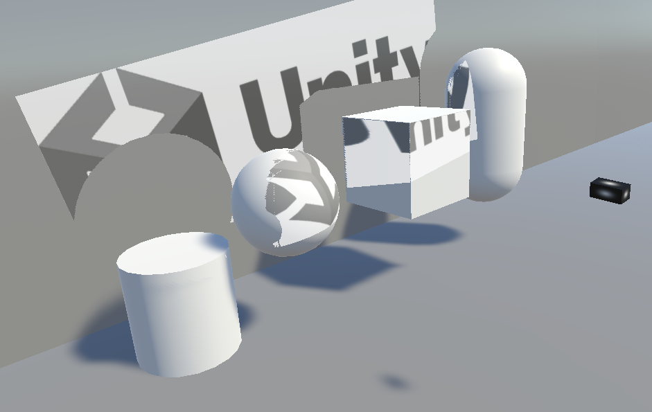

# Unity Custom Projector

This document provides an overview of the custom projector system in Unity, along with installation and usage instructions.

## Overview
This package includes a custom projector component that allows for advanced projection effects in Unity. It is designed to be easily integrated into existing projects and provides configurable parameters for customization.

## YouTube

  

## Installation
1. Import the provided `.unitypackage` into your Unity project.
2. Attach the `ProjectorRay` script to a GameObject.

## Usage
1. Assign the `ProjectorRayVertexComputeShader.compute` to the `ComputeShader` field in the component.
2. Assign a `Material` to the `Rendering Material` field in the component.
3. Configure the necessary parameters in the Inspector:
   - **Texture Width & Height**: Specifies the texture size for the projector camera. Higher values improve quality but increase processing load.
   - **Depth Cam Near/Far/FoV**: Defines the near and far clipping planes and the field of view of the projector camera.
   - **Layer Mask**: Specifies which objects are considered by the projector camera.
   - **Rendering Material**: The material projected by the projector.
   - **Depth Continuity Threshold**: Sets the maximum depth difference where the mesh will be placed.
4. Run the scene to see the projection effect in action.

### Performance Considerations
- Increasing the texture resolution will increase the computational load. Adjust the resolution to balance quality and performance.
- If optimization is needed, consider using Unity's [Decals](https://docs.unity3d.com/6000.2/Documentation/Manual/visual-effects-decals.html) system as an alternative.

## License
This package is distributed under the MIT License.